# dc-networking

Cross-team tracker for the networking side of
[decoupled consensus](https://ethresear.ch/t/unblocking-faster-finality-with-decoupled-consensus/24527):
delivering AC (available-chain) and FG (finality-gadget) votes at
validator-set scale.

  <picture>
    <source media="(prefers-color-scheme: dark)" srcset="assets/dc-animation-dark.svg">
    
  </picture>

## Layout

| Path | What |
|---|---|
| [`design/`](design/) | The current planned design: [`explainer.md`](design/explainer.md) (the proposal) and [`requirements.md`](design/requirements.md) (binding parameter envelope — changes are decisions, date them) |
| [`research/`](research/) | Reasoning behind design decisions and design options: [`open_questions.md`](research/open_questions.md) (settled vs. open tracker), [`ssz.md`](research/ssz.md) (wire objects & byte accounting), [`ac/`](research/ac/) (AC slot structure), [`fg/`](research/fg/) (FG round) |
| [`specs/`](specs/) | Exact specifications (to come) — meanwhile [`README.md`](specs/README.md) points at Francesco's executable Simplex pyspec |
| [`poc/`](poc/) | Proof of concept: [`poc.md`](poc/poc.md) (Shadow → Prysm-on-Shadow → Kurtosis) |
| [`benchmarking/`](benchmarking/) | Benchmark results |
| [`meetings/`](meetings/) | Meeting notes, one file per call: `YYYY-MM-DD.md` |
| `personal/<name>/` | Personal scratchpads — unreviewed |
