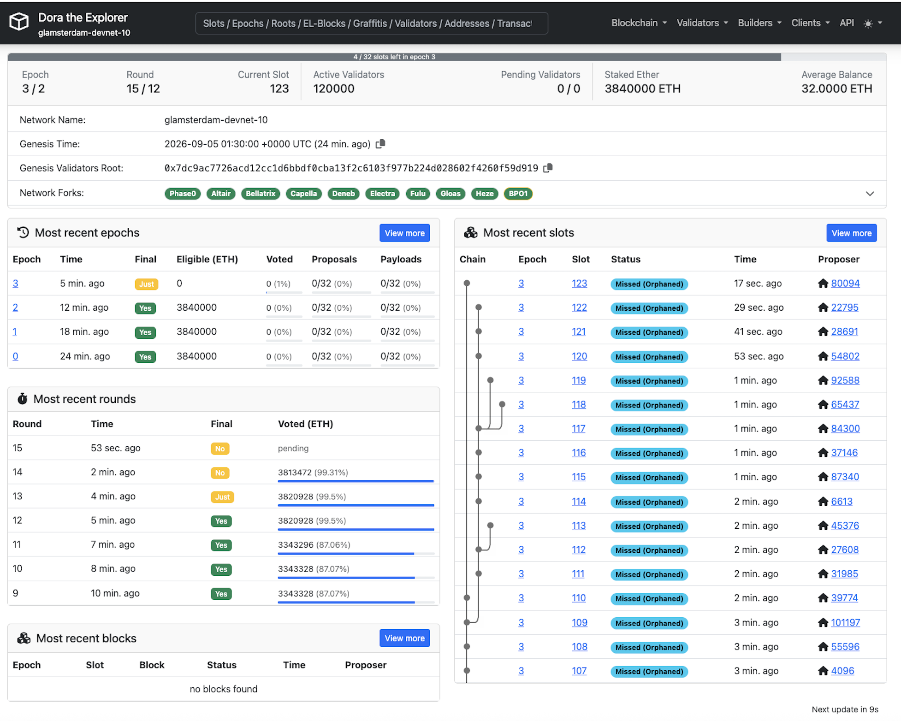
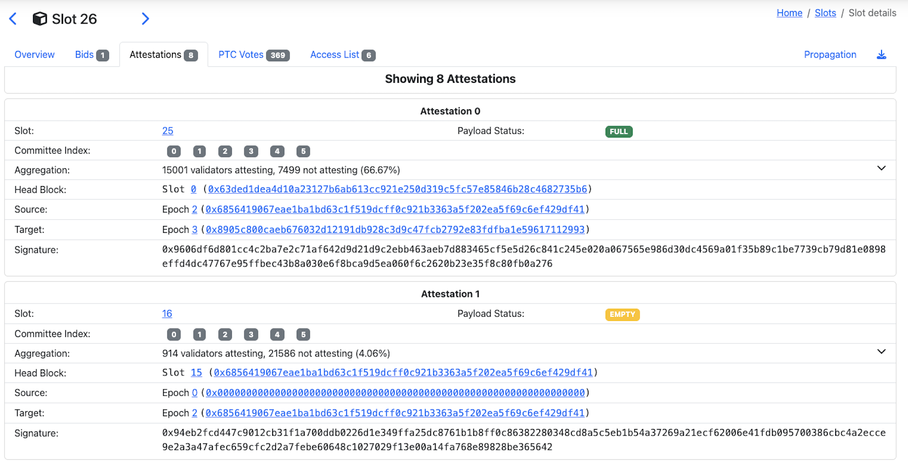

# nft devnet 1

We ran the first DC devnet on 05-09-2026.

## Setup

- **120'000 validators** (about 1/8 of mainnet)
- **1000 nodes** (about 1/8 of mainnet)
    - 800 home nodes with single validator([EIP-7870](https://eips.ethereum.org/EIPS/eip-7870))
    - 200 supernodes with 120k - 800 / 200 = 596 validators each(1 Gbit/s)
- **6 attestation subnets**, home nodes subscribed to 2 subnets
- **round length: 8 slots**
- **committee size:** 120000 /  8 / 6 = **2500**

Then to simulate non-perfect network conditions, we add 4x more aggregators, to add more load on aggregates:
- **aggregators per committee: 64** 
- agg size: ~760 B 
- number of aggregates: 64 * committees = 384 per slot, ~0.3 MB on the global topic

On top, we add the load of the **512 AC votes**, and dummy bytes for **VRF selection proofs**, and **goldfish view merge**.

## Issues

1. Packing attestations at proposer: Prysm bug?
2. Validator duties computation in first slots: Prysm inefficiency
3. Crash on Slot 117: no time to start spamoor

### Open questions:
4. Crash post mortem
5. What happened to aggregations? Seems like many are the same, or have exactly 2/3 of attestations

## Limitations

1. Probably too much b/w on super nodes - can we adapt EIP 7870 to include per validator?

## Learnings

1. Ultrasound / xray data analysis is in this folder.
2. We are on the right track, but its not easy.
3. We learned how deployment works
4. In the future we might think about 
    - Better pipelining, as now everything is front loaded.
    - Increasing the requirements for supernodes to be in all subnets. Instead "regular" supernodes could subscribe to subnets less time in advance: **lighthouse & teku vs. prysm**
    - Better assignment of validator duties

## Next Target: Devnet before Cambridge!
- **Closer to final networking specs**
- **With full DC prototype?**
- Better specs
- Optimizations (bundled attestations)
- Stable code
- More Shadow runs beforeand

### TODOs

- [ ] Replicate setup in shadow sims
- [ ] Establish a pipeline from smaller network to mainnet
- [ ] **Improve SPECS % Design**
- [ ] Devops: Can we deploy more and faster for cheaper iterations?
- [ ] Consider switching to 128 subnets?
    - [ ] understand performance implications
    - [ ] understand security implications

