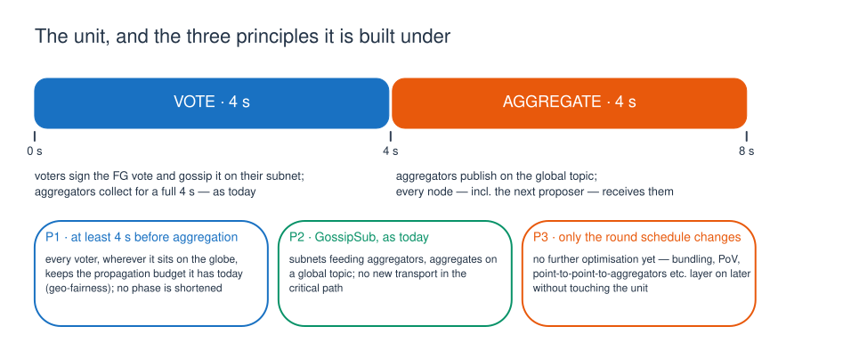
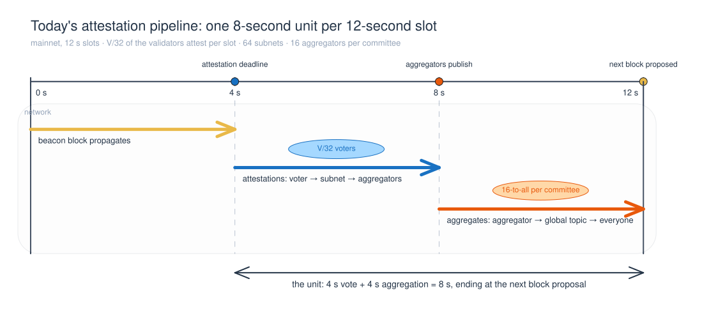
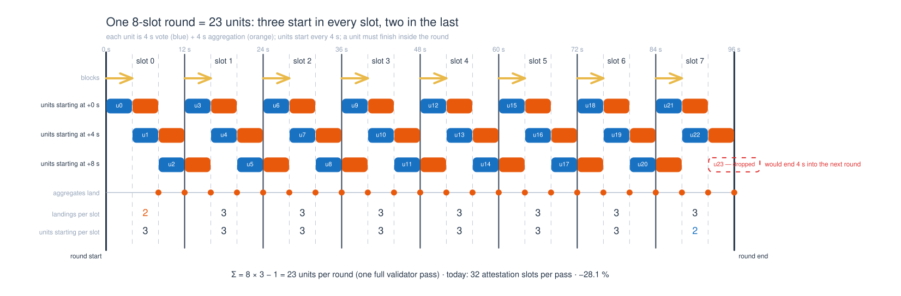
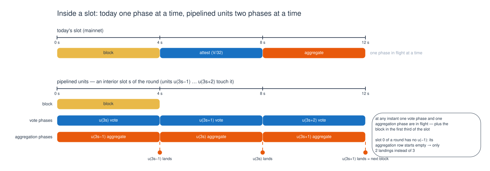
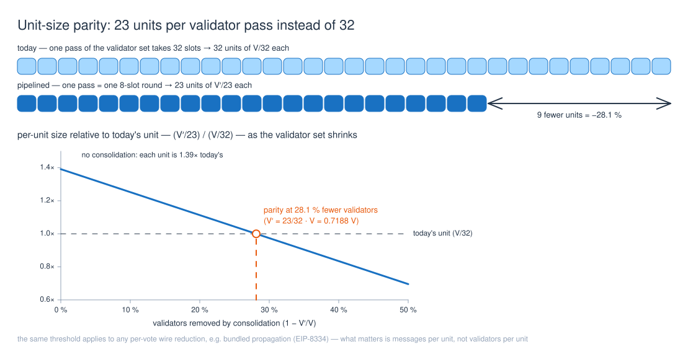
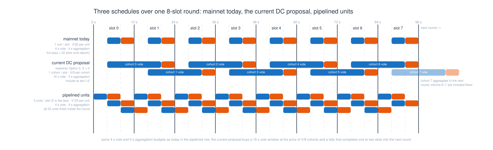
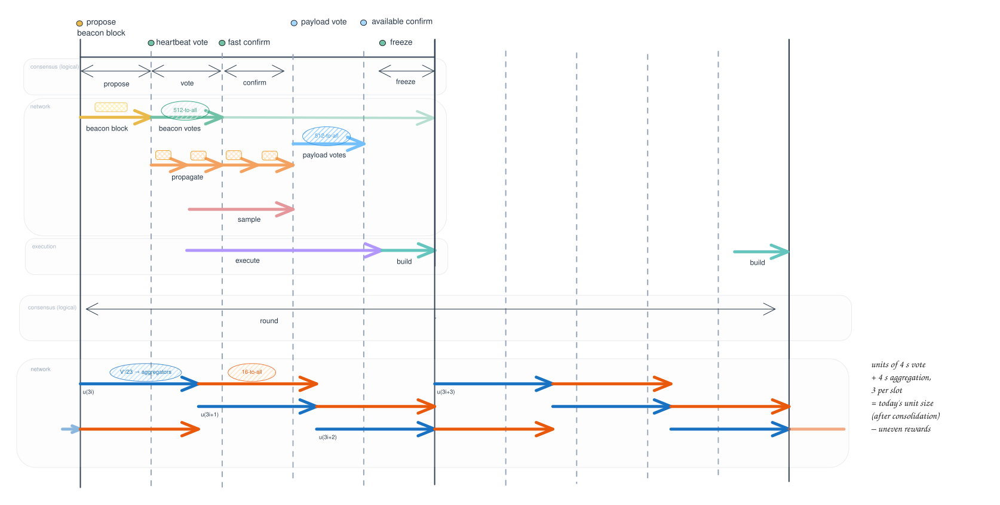
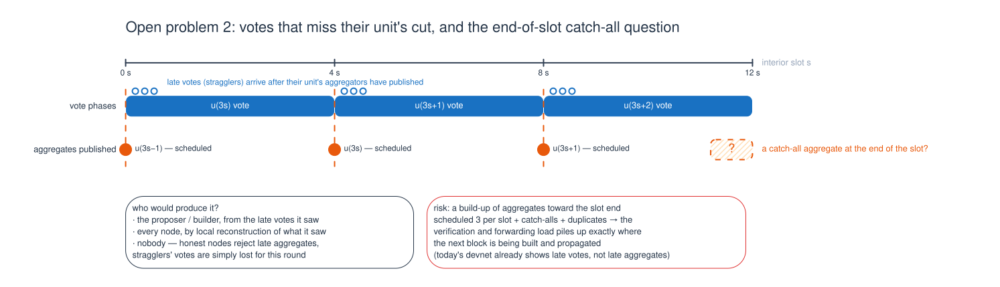
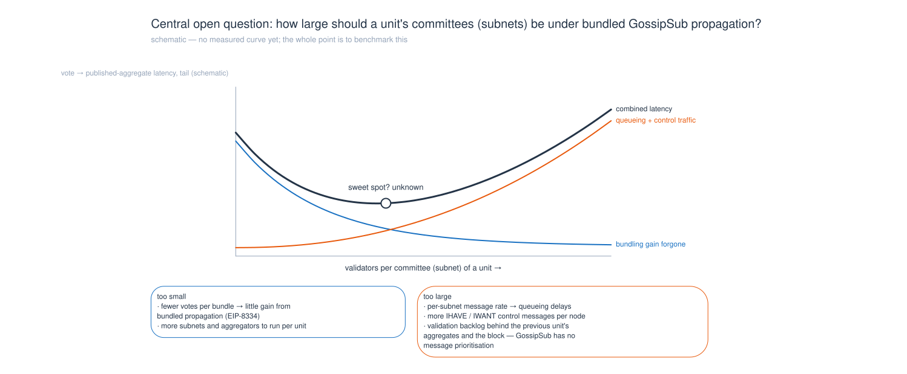

<!-- Publishing on HackMD: paste this file as-is. Once the repo is pushed, replace
     "figures/" in the image links with
     https://raw.githubusercontent.com/ethereum/dc-networking/main/research/fg/pipelined-units/figures/
     — or drag the PNG copies in figures/png/ into the HackMD note instead. -->

> **Provenance: agent** — 2026-09-22, written up by an agent from Yann's dictated design notes. The design, its three principles and the two tracked problems are Yann's; the text has not yet had his line-by-line pass. Inspired by discussions with **Anton Nashatyrev and Sukun Tarachandani** — the idea was first floated on the [2026-09-08 call](../../../meetings/2026-09-08.md) (pipelining to move the FG votes to the 8-second mark of the slot and use the idle time). Paragraphs marked **⚠ agent note** are the agent's own flags for review, not part of the proposal.
>
> **Nonbinding.** This note proposes replacing the timing invariant in [`requirements.md`](../../../design/requirements.md) ("a subround's votes are aggregated in the next slot; the vote-start offset X ∈ [0 s, 8 s] is a tunable") with fixed 4 s + 4 s units. It is not a decision and does not modify the binding requirements.
>
> **Figures:** SVG in [`figures/`](figures/), editable Excalidraw sources in [`excalidraw/`](excalidraw/), PNG copies for HackMD uploads in [`figures/png/`](figures/png/); all generated by [`generate_figures.py`](generate_figures.py). Figure 9 repurposes the explainer's [`fg_slot_structure_current.excalidraw`](../../ac/fg_slot_structure_current.excalidraw). Vote phases are blue and aggregation phases orange throughout (the explainer's blue/grape pair is indistinguishable under deuteranopia).

# Pipelined FG-vote units

## TL;DR

- **Unit.** FG (finality-gadget) votes propagate in fixed units of **8 s = 4 s of voting followed by 4 s of aggregation** — the exact shape of today's attestation pipeline (attest at 4 s, aggregators publish at 8 s, next block at 12 s).
- **Schedule.** A new unit starts every 4 s: three per slot, at +0 s, +4 s and +8 s. A unit must finish inside its round, so the last slot of the round starts only two. An 8-slot round therefore has **8 × 3 − 1 = 23 units**, each carrying 1/23 of the validator set, and the first slot lands only two aggregates where every other slot lands three.
- **Load argument.** Today one full pass of the validator set takes 32 attestation slots; here it takes 23 units, so a unit carries 32/23 ≈ 1.39× the validators of a mainnet committee slot — unless the validator set shrinks. Once consolidation removes **≥ 28.1 %** of the validators (V′ ≤ 23/32 · V), a unit is no larger than today's, and the per-unit propagation assumptions mainnet already runs on carry over unchanged. Nothing else changes: GossipSub, subnets, aggregator selection stay as they are; optimisations come later, on top.
- **Costs and open items.** Uneven per-slot inclusion (2 vs 3 aggregates — accepted for now); no answer yet for votes that miss their unit's cut and the temptation of an end-of-slot catch-all aggregate; and the central sizing question — how large should a unit's committees be under bundled GossipSub propagation?

## Principles

| | Principle | Consequence |
|---|---|---|
| **P1** | **At least 4 s before aggregation.** Every voter, wherever it sits on the globe, keeps the propagation budget it has today (geo-fairness). | No phase is shortened to gain throughput: the unit is 4 s + 4 s, never 2 s + 2 s. |
| **P2** | **GossipSub.** Subnets feeding aggregators, aggregates on a global topic — the propagation path already settled in [`open_questions.md`](../../open_questions.md) ("the standard gossip vertical as of H*"). | No new transport in the critical path. PoV, point-to-point-to-aggregators and brokers stay future ideas (Q10–Q12). |
| **P3** | **Only the round architecture is tuned.** The design lever is the schedule — unit length, units per slot, offsets — and nothing else. | Bundled propagation ([EIP-8334](https://github.com/ethereum/EIPs/pull/11905)), batching at source, tree aggregation etc. layer on later without touching the unit. |

## The unit

Mainnet already propagates attestations in a unit of exactly this shape. A committee slot's attesters (V/32 of the validators, spread over 64 subnets with 16 aggregators each) sign once the block is seen or at 4 s at the latest, their attestations reach the aggregators by 8 s, the aggregators publish on the global topic at 8 s, and the aggregates have reached everyone — including the next proposer — by 12 s.

| | today: mainnet attestation slot | pipelined FG unit |
|---|---|---|
| voters per unit | V/32 (one committee slot) | V′/23 (one cohort) |
| vote phase | 4 s — attest, propagate voter → subnet → aggregators | 4 s, same path |
| aggregation phase | 4 s — aggregators publish, aggregates propagate to all nodes | 4 s, same path |
| at the unit's end | the next proposer includes the aggregates | the next proposer includes the aggregates |

In DC vocabulary a unit is a **subround** — "the voting window of one cohort" ([`requirements.md`](../../../design/requirements.md)) — with its shape fixed to 4 s + 4 s. The current proposal ([explainer, Option 5](../../../design/explainer.md)) instead gives each cohort a vote window of up to 16 s (slot *i*, T = 4 s + X, until slot *i*+1, T = 8 s) and aggregates in the next slot; see [Where it sits](#where-it-sits-among-the-existing-designs).

## The round: 23 units

Unit *ui* (*i* = 0 … 22) starts at *t* = 4*i* s into the round. Its cohort votes during [4*i*, 4*i* + 4) s, its aggregators publish at 4*i* + 4 s, and the aggregates have propagated by 4*i* + 8 s — the unit's **landing** — after which any block can include them. The unit that would start at 92 s (slot 7, +8 s) would land 4 s into the next round and is dropped: with the round over, nothing can be done with it.

| slot | 0 | 1 | 2 | 3 | 4 | 5 | 6 | 7 | Σ |
|---|---|---|---|---|---|---|---|---|---|
| units starting (at +0, +4, +8 s) | 3 | 3 | 3 | 3 | 3 | 3 | 3 | **2** | **23** |
| aggregates landing (at +4, +8, +12 s) | **2** | 3 | 3 | 3 | 3 | 3 | 3 | 3 | **23** |

The aggregates published at +0, +4 and +8 s of a slot are all included by the block proposed at +12 s (the next slot's proposer), with 12 s, 8 s and 4 s between publication and proposal. The last of these is exactly today's margin (publish at 8 s, propose at 12 s); the other two have slack. Slot 0 of a round has no predecessor unit, so its aggregation row starts empty and only two aggregates land — the source of the unevenness tracked as [Problem 1](#problem-1--reward-variance-accepted-for-now).

At any instant one unit is in its vote phase and another in its aggregation phase, and during the first third of each slot the block propagates as well.

## Load: 23 units against 32, and the consolidation condition

The load argument is **unit-size parity**. A unit's propagation load is set by the number of voters it carries. Today a validator votes once per 32-slot epoch, so a mainnet committee slot carries V/32 voters; here a validator votes once per 8-slot round, so a unit carries V′/23. The two are equal when

V′/23 ≤ V/32 ⟺ V′ ≤ (23/32) · V = 0.71875 · V,

i.e. once consolidation has removed **28.125 %** of the validators. From that point every unit is at most as large as a mainnet committee slot today, on the same 4 s + 4 s timeline, over the same GossipSub path — so the propagation assumptions we already rely on (subnet load, aggregator count, control-message overhead, the 4 s budgets) transfer without a new argument. Below that point the same schedule still works, but a unit is up to 32/23 ≈ 1.39× today's, and that factor has to be earned elsewhere (bundling, see below) or measured.

| for concreteness, V = 10⁶ today | voters per unit | vote window | aggregation window |
|---|---|---|---|
| mainnet today | V/32 = 31 250 | 4 s | 4 s |
| current DC proposal (explainer Option 5) | V/8 = 125 000 (the explainer works with ~100k per subround) | up to 16 s | 4 s |
| pipelined units, no consolidation | V/23 ≈ 43 478 (1.39×) | 4 s | 4 s |
| pipelined units at V′ = 0.71875 · V | 31 250 (1.00×) | 4 s | 4 s |

[`requirements.md`](../../../design/requirements.md) asks for the whole 10⁶ → 10⁴ consolidation trajectory and the repo carries no consolidation target, so the 28.1 % is a threshold to track against reality, not an assumption. The same threshold applies to any per-vote reduction of wire traffic — bundled propagation (EIP-8334, roughly 2.3× fewer bytes per signer than single attestations) buys it on the bandwidth and message-count axis without any consolidation — but not to signature verification, which still scales with voters per unit.

**⚠ agent note — per-unit vs per-instant load.** Parity is a per-unit statement. Per instant, the pipelined schedule always has one vote phase *and* one aggregation phase in flight (figure 4), whereas today's slot runs block → attestations → aggregates one after the other. A node therefore sees subnet vote traffic and global-topic aggregate traffic at the same time, and both overlap the block during the first third of every slot. The current DC proposal has the same kind of overlap (cohort *k* aggregates while cohort *k*+1 votes), so this is not new to DC — but "the network load at any given time is the same as today" should be read as "each phase's load is the same as today's corresponding phase" until the benchmark suite has measured the sum. The 2026-08-25 call already saw home nodes "choked" during payload publishing, which is where the +0 s unit's vote phase now sits.

## What this buys

- **Replicated assumptions, no new argument.** Same unit shape, same path, same per-unit size (after consolidation) as the pipeline mainnet has run since genesis; the security and performance reasoning about a committee slot applies to a unit as is.
- **Geo-fairness by construction (P1).** The 4 s vote budget is today's; no validator gets less time than it has now.
- **Slot-aligned, evenly spread load.** Units start on the 0/4/8 s grid, so FG traffic is periodic within the slot and lines up with the AC phases. The explainer's objection to its Option 4 — "load not synced to other loads → harder to benchmark, maintain" — does not apply.
- **The round closes inside the round.** All 23 units have published by 92 s, so the block that opens the next round can carry the whole tally. Under the current proposal cohort 7 aggregates in slot 8 and is included in slot 9 ("vote in slot *i*, aggregate in *i*+1, include in *i*+2", [`requirements.md`](../../../design/requirements.md)).
- **Smaller cohorts than the current proposal.** V/23 instead of V/8 voters per unit — 2.9× fewer — in exchange for a 4 s instead of a 16 s vote window.
- **Extensible (P3).** Bundling, batching, PoV, point-to-point delivery to aggregators all fit inside a unit without changing the schedule; if they buy headroom, the same schedule can later shrink the round toward the 4-slot stretch goal.

## Where it sits among the existing designs

*The explainer's figure with its FG network band swapped for pipelined units; the AC bands are untouched. Editable source: [`excalidraw/09-fg-slot-structure-pipelined-units.excalidraw`](excalidraw/09-fg-slot-structure-pipelined-units.excalidraw); the original is rendered in [`figures/00-fg-slot-structure-current.svg`](figures/00-fg-slot-structure-current.svg) for side-by-side reading.*

- **Explainer Option 4, "voting across slots with uneven spacing"** — dismissed there as "technically 'optimized', but uneven rewards, and load not synced to other loads". This proposal is Option 4 on an even 4 s grid: the load *is* synced, and the reward unevenness is accepted deliberately (Problem 1). The "optimized" band of [`fg_slot_structure.excalidraw`](../../ac/fg_slot_structure.excalidraw) (4 × 1024-to-256, 3 × 16-to-all, annotated "uneven rewards") is the closest earlier sketch.
- **Explainer Option 5, the current proposal** — one cohort per slot, 16 s vote window, aggregation in the next slot, "even load, even rewards". Pipelined units trade its long vote window and even rewards for today's unit shape and unit-size parity; the comparison figure above shows both on one axis.
- **Pattern exploration, option 4-plus** ([`fg-vote-dissemination.md`](../../../design/pattern-exploration/fg-vote-dissemination.md), local draft, uncommitted as of 2026-09-22) — two 4 s ingress waves per slot sharing one 8 s egress. Units keep vote and aggregation paired per cohort and stagger the egress over the slot instead; its Idea 3 ("twice 4 s + 2 s") is what P1 rules out.
- **[2026-09-08 call](../../../meetings/2026-09-08.md)** — the idea's origin (pipelining to move the FG votes to the 8-second mark of the slot); the concerns raised there — round boundaries, healing, fairness — are exactly Problem 1 and the boundary question below. **[2026-08-25 call](../../../meetings/2026-08-25.md)** — the devnet's "missed FFG aggregates" were votes arriving after the 6 s deadline, not missed aggregates (Problem 2), and transport-level prioritisation does not work across peer connections (committee-size question).
- **Sukun's eth-slot-sim** ([`benchmarking/eth-slot-sim.md`](../../../benchmarking/eth-slot-sim.md)) — the "5 finality sub rounds" runs are the closest measured precedent; with batched attestations the finality-attestation p99 fell from 2.8 s to 1.4 s and the p99.9 from 10.8 s to 4.7 s.

## Tracked problems

### Problem 1 — reward variance (accepted for now)

The first slot of a round lands two aggregates and every other slot three, so blocks carry either 2 or 3 units' worth of FG aggregates and proposer inclusion rewards vary with the slot. Within a slot, a unit landing at +12 s has today's 4 s margin to the next block while one landing at +4 s has 12 s, so the risk of missing the next block differs by unit. This gives up the current proposal's "even and continuous aggregation" property on purpose, in exchange for unit parity. **Decision: accept the variance for now**; revisit only if it turns out to matter (it could be evened out in the reward function later).

### Problem 2 — end-of-slot congestion and late aggregates (open)

Honest and rational aggregators publish at their unit's cut. Votes that arrive after the cut — stragglers — are covered by no scheduled aggregate. It might make sense to have one more aggregate at the end of the slot that sweeps them up, but it is not clear where it should come from:

- **nobody** — honest nodes simply reject late aggregates; a straggler's vote is lost for this round (a validator votes once per round, in its unit);
- **the proposer / builder**, assembling one from the late votes it saw;
- **local reconstruction** — every node aggregates what it saw, so the aggregate need not be gossiped at all.

The danger is a build-up of more and more aggregates into the slot: three scheduled ones plus catch-alls plus duplicates, with the verification and forwarding load piling up exactly where the next block is being built and propagated. Devnet-1 already shows the symptom to watch (late votes, not late aggregates). **Status: tracked, no proposal yet.**

## Central open question — committee size under bundled propagation

What is the optimal committee (subnet) size for a unit, given bundled attestation propagation over GossipSub (EIP-8334)?

- **Too large**, and a subnet's message rate causes queueing delays, more IHAVE/IWANT control traffic per node, and a validation backlog behind the previous unit's aggregates and the block — GossipSub has no message prioritisation, and transport-level priorities only work within one connection (2026-08-25 call).
- **Too small**, and there are fewer votes per bundle, so bundled propagation gains little, while more subnets and aggregators have to be run per unit.
- **Overlap** is the other axis: units overlap by 4 s, and if they were packed more tightly the missing prioritisation would let a unit's vote phase compete with its neighbour's aggregates. P1 keeps the overlap at exactly one phase, but the interaction still has to be measured.

Devnet-1 ran 120 000 validators in 8 slots over 6 subnets (committees of 2 500, 64 aggregators each); a unit at V = 10⁶ over 64 subnets would have committees of ≈ 680 (≈ 490 at parity). Where the curve bottoms out is what the benchmark suite has to find.

## Further open questions (⚠ agent-flagged)

1. **Grid alignment with the round start.** *u*0 votes during [0, 4) s of the round's first slot — before that slot's block has propagated and before the round-start freeze that [`transitions/boundary-pipelining.md`](../../transitions/boundary-pipelining.md) analyses (it blesses voting at slot 0, T = 4 s + X, and rules out voting a slot early). Either the +0 s units vote on the *previous* slot's confirmed head (the explainer's Option 2 flavour: "more time, target more likely equal → better aggregation"), or the grid shifts by 4 s (units at +4, +8, +12 s), in which case either the last unit lands 4 s into the next round — the current proposal's inclusion pattern — or the round has 22 units. Q16's transition-computation gap (duty assignment, subnet churn) sits at the same boundary.
2. **Target selection per unit.** [`requirements.md`](../../../design/requirements.md) picks the target at T = 4 s + X of the assigned slot; with three units per slot the three cohorts select at +0, +4 and +8 s and may name different targets, fragmenting the slot's BLS aggregates by (height, target). Benign for bundling (signatures stay individual), relevant for aggregation (Q3).
3. **PoC support.** The Prysm fork "doesn't allow a pipelined structure with the finality vote in one slot and the aggregate vote in the next" ([`benchmarking/prysm/prysm.md`](../../../benchmarking/prysm/prysm.md)); the +8 s unit needs exactly that.

## Suggested experiments

- [ ] (perf) eth-slot-sim / Shadow: 23-unit schedule vs the 8-cohort schedule vs today's, at equal V; per-node bandwidth per 4 s window (the per-instant sum in the agent note), p50/p99/p99.9 vote → published aggregate and aggregate → all-nodes.
- [ ] (perf) sweep committee size / subnet count per unit with bundling on and off; record IHAVE/IWANT counts, queueing delay, validation backlog.
- [ ] (perf) fraction of votes missing their unit's cut, per unit offset (+0/+4/+8 s), with and without the block overlapping — sizes Problem 2.
- [ ] (spec) reward-variance model: per-block inclusion (2 vs 3 units), inclusion-miss probability by landing offset — checks that Problem 1 stays negligible.
- [ ] (spec) decide the grid alignment at the round start together with Q3/Q16.

## References

- [`design/requirements.md`](../../../design/requirements.md) — binding envelope: V/P notation, round/subround, "aggregated in the next slot", target at T = 4 s + X, include in slot *i*+2.
- [`design/explainer.md`](../../../design/explainer.md) — current proposal (Option 5) and the deprecated Options 1–4.
- [`research/open_questions.md`](../../open_questions.md) — Q17 tracks this note; P2 propagation-path decision of 2026-07-20.
- [`research/transitions/boundary-pipelining.md`](../../transitions/boundary-pipelining.md) — round-start freeze and the justification dependency.
- [`meetings/2026-09-08.md`](../../../meetings/2026-09-08.md), [`meetings/2026-08-25.md`](../../../meetings/2026-08-25.md), [`meetings/2026-07-28.md`](../../../meetings/2026-07-28.md).
- [`benchmarking/eth-slot-sim.md`](../../../benchmarking/eth-slot-sim.md), [`benchmarking/nft-devnet-1/description.md`](../../../benchmarking/nft-devnet-1/description.md).
- EIP-8334 *Bundled attestation propagation* (Tarachandani), PR-stage: [ethereum/EIPs#11905](https://github.com/ethereum/EIPs/pull/11905).
